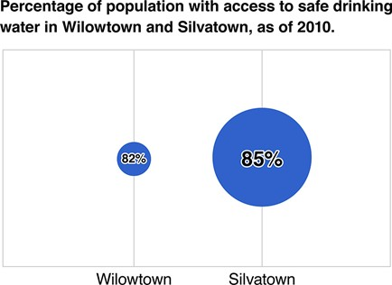
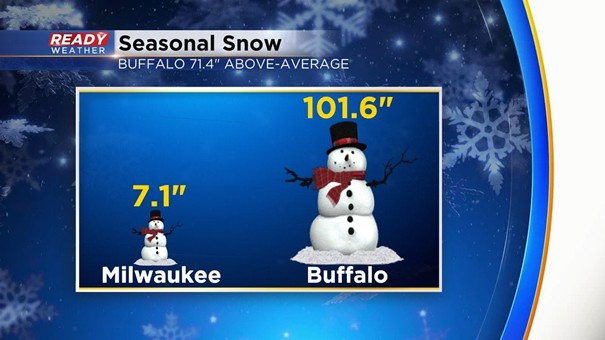
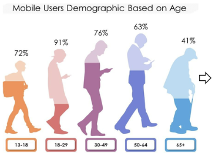

# Image 1
Ce graphique montre une distorsion visuelle parce que la taille des bulles ne correspond pas proportionnellement aux pourcentages.
La bulle de Silvatown (85 %) est beaucoup plus grande que celle de Wilowtown (82 %), ce qui exagère la différence entre les 2 
Pour corriger ce graphique il faut utiliser un graphique en barres ou changer la taille de la bulle de Wilowtown qui doit être un peu plus petit que celle de Silvatown

# Image 2

Ce graphique montre que Milwaukee a un total de 7,1 pouces de neige, tandis que Buffalo en a 101,6 pouces
L'œil humain compare les tailles visuelles avant de lire les chiffres.
Pour corriger on peut commence à 0 et monter jusqu'à 110 pouces pour avoir une bonne échelle.
ou par exemple on dit qu’une icône de bonhomme de neige = 7 pouces de neige.
et donc un seul bonhomme de neige pour Milwaukee et 14 bonhommes pour Buffalo

# Image 3

Le graphique montre des silhouettes humaines remplies de couleur pour représenter le pourcentage d'utilisateurs de téléphones portables par âge
Pour que le graphique soit exact, il faut remplir précisément la hauteur de chaque silhouette en fonction de son pourcentage. 
Le niveau de remplissage des silhouettes est totalement faux par rapport aux pourcentages affichés au-dessus : 
par exemple, la silhouette des 50-64 ans (63 %) est presque entièrement colorée, tandis que celle des 18-29 ans (91 %) est vide aux deux tiers.
Pour corriger, la silhouette à 91 % doit être colorée presque jusqu'au sommet du crâne, et celle à 41 % doit être remplie un peu en dessous de la moitié.

